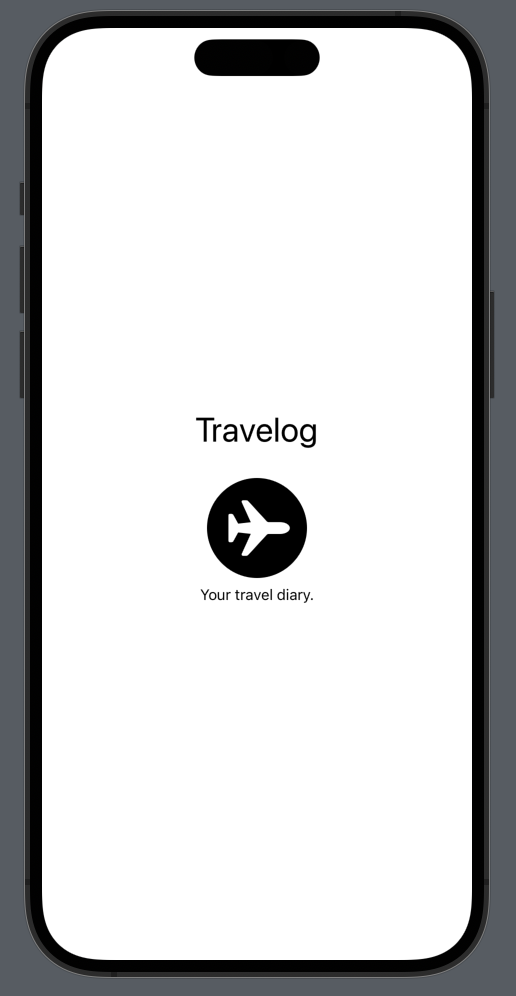
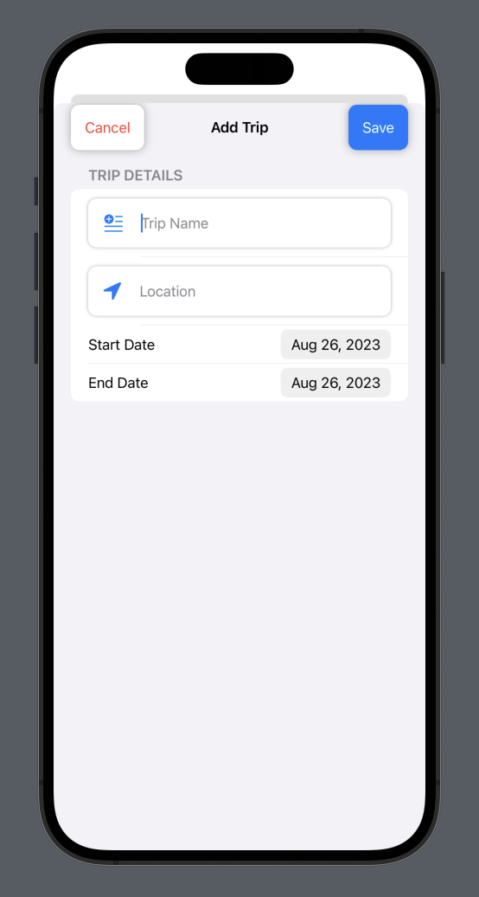

# TravelLog 🌍✈️

A Swift-based iOS application for travel enthusiasts to log and manage their trips.

 
<!-- Replace 'link_to_logo_image.png' with the link to your logo image. -->

## Table of Contents
- [Features](#features)
- [Screenshots](#screenshots)
- [Installation](#installation)
- [Usage](#usage)
- [Technologies Used](#technologies-used)
- [Contributing](#contributing)
- [License](#license)

## Features
- **User Authentication**: Secure login system.
- **Add/Edit Trips**: Users can add new trips with relevant details or edit existing ones.
- **Notifications**: Integrated notification system to keep users engaged.
- **Interactive UI**: Sleek and intuitive user interface with smooth transitions.

## Screenshots
<!-- Add screenshots of your app. -->
- 
- 
- (image3.png)

## Installation
1. Clone the repository:
```bash
git clone https://github.com/your_username/TravelLog.git
```
2. Navigate to the project directory:
```bash
cd TravelLog
```
3. Install the necessary dependencies (if any).
4. Open the project in Xcode and run it on your desired device or simulator.

## Usage
1. Launch the app.
2. Log in or sign up.
3. Start adding your trips and enjoy the features!

## Technologies Used
- **SwiftUI**: For building the app's UI components.
- **Swift**: The core programming language for the app logic.
- **NotificationManager**: A hypothetical tool for managing notifications.
- ... (Any other technologies, frameworks, or tools used)

## Contributing
We welcome contributions from the community. If you'd like to improve the "TravelLog" app, here's how:
1. Fork the project.
2. Create a new branch (`git checkout -b new-feature`).
3. Make your changes.
4. Commit your changes (`git commit -am 'Added some feature'`).
5. Push to the branch (`git push origin new-feature`).
6. Create a new Pull Request.

Thank you to all the contributors who help make this project better!

## License
This project is licensed under the MIT License. See `LICENSE.md` for more information.
```
